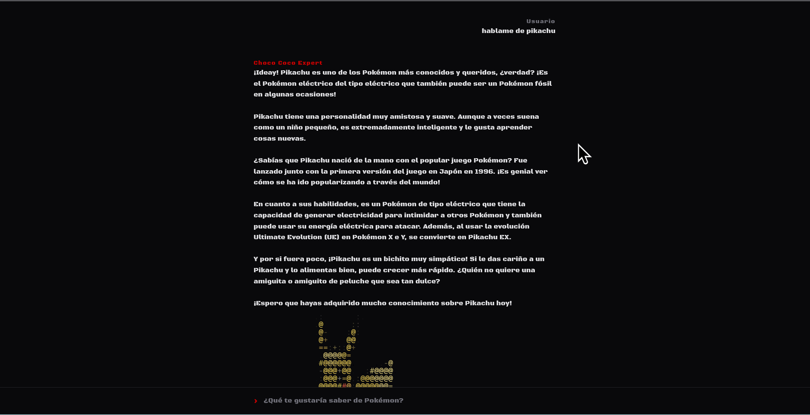
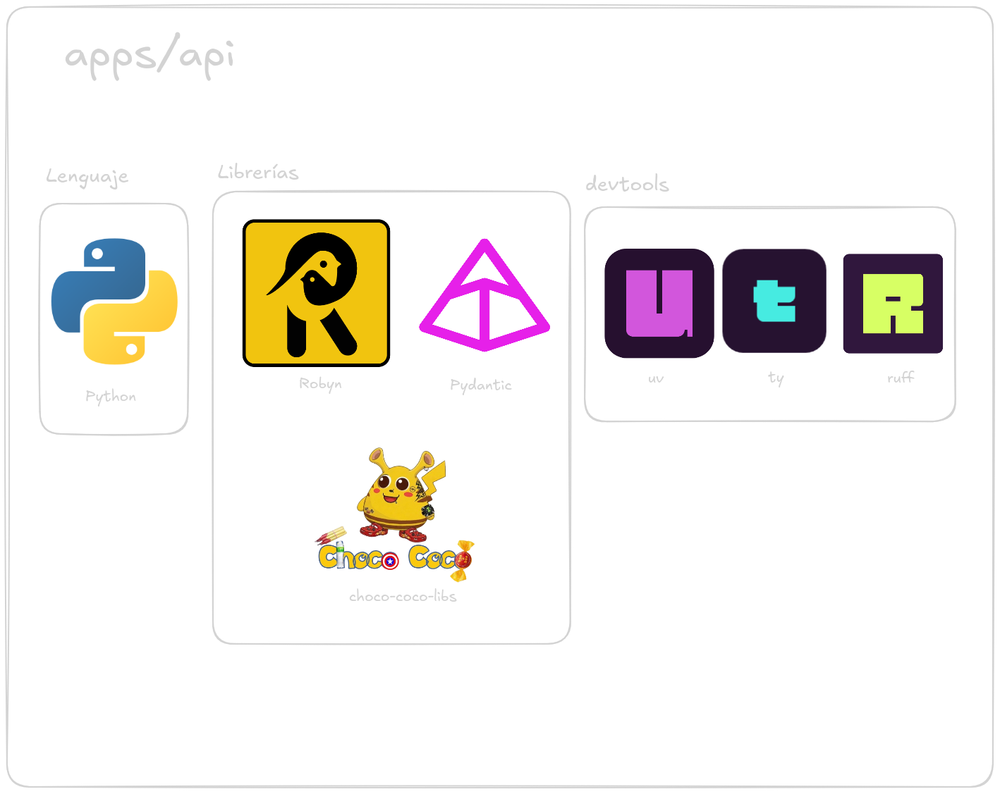
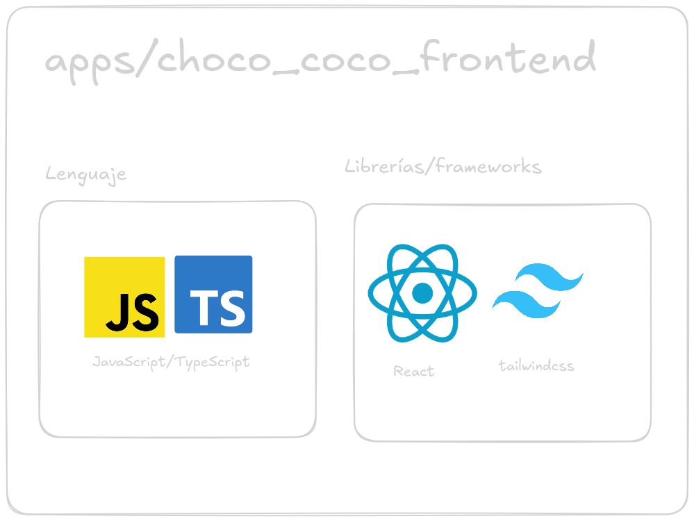
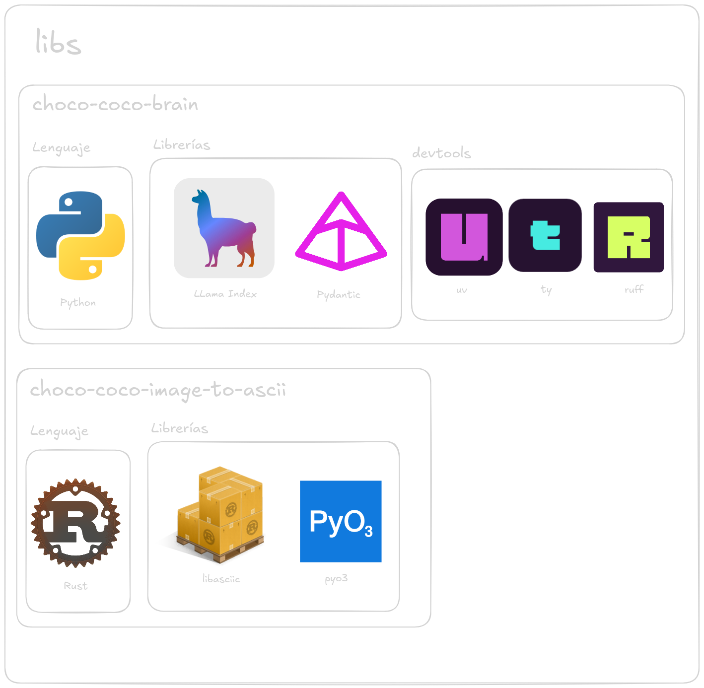
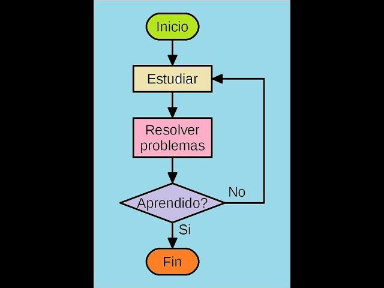
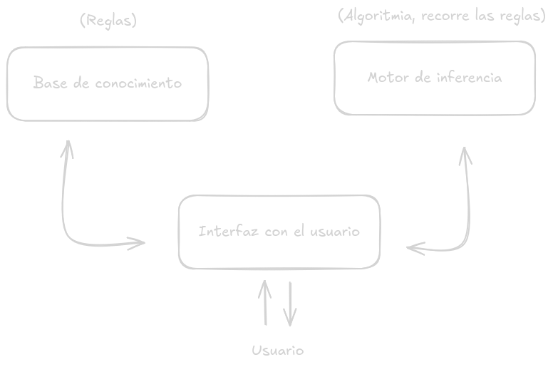

# Plantemiento del problema

Navegar y consultar información de los Pokémon por internet a veces puede
ser una tarea abrumadora:

- Muchos lugares en donde consultar.
- información presentada de distintas maneras.
- páginas con interfaces gráficas un poco difíciles de usar.

<!-- pause -->

```bash +exec
firefox --new-tab https://www.wikidex.net/wiki/Venusaur
```

<!-- pause -->

¿Qué pasaría si existiese una forma en la cual poder consultar información de los Pokémon con lenguaje natural?,
una forma en la cual fuese como si estuviésemos hablando con un experto en este ámbito, de forma local,
privada, aislada y sin conexión a internet.

<!-- end_slide -->

# Choco Coco

<!-- column_layout: [1, 1] -->

<!-- column: 0 -->


<!-- column: 1 -->

Un Sistema Experto de Pokémon para consultar de forma centralizada información básica y general sobre los distintos Pokémon.

<!-- pause -->

> Choco Coco no es más que una página web, en la cual se le puede hacer preguntas y éste le contestara:



<!-- end_slide -->

# Objetivos

<!-- column_layout: [1, 1] -->

<!-- column: 0 -->

## General:

- Crear un Sistema Experto de Pokémon para consultar de forma centralizada información básica y general sobre los distintos Pokémon.

<!-- column: 1 -->

## Específicos:

- Desarrollar la arquitectura del sistema experto mediante un pipeline de RAG (LLM y modelo de embeddings)
  con base de conocimiento proporcionada y una personalidad nicaragüense.
- Crear una REST API en la cual permita consultar al Sistema Experto.
- Programar un front-end en formato de chat que servirá como front-end para el sistema experto.

<!-- end_slide -->

# Arquitectura

<!-- column_layout: [1, 1] -->

<!-- column: 0 -->

Es un monorepo

```bash +exec
/// cd ../../
lstr --gitignore --icons --dirs-only
```

<!-- column: 1 -->





<!-- end_slide -->

# Arquitectura



<!-- end_slide -->

# ¿Cómo hacemos para que responda de distinta manera cuando se hace la misma pregunta varias veces?

<!-- pause -->

## Primero debemos entender cómo funciona un Sistema Experto de manera tradicional...

"Sistema informático que emula el razonamiento actuando tal y como lo
haría un experto en cualquier área de conocimiento"
(colaboradores de Wikipedia, 2026). ,ediante el razonamiento a través de cuerpos de conocimiento,
representados principalmente como normas sí-entonces más que a través
de código de procedimiento convencional.

<!-- column_layout: [1, 1] -->

<!-- column: 0 -->



<!-- column: 1 -->



<!-- reset_layout -->

<!-- pause -->

```bash +acquire_terminal
/// source snippets/expert-age-system-01/.venv/bin/activate
uv run snippets/expert-age-system-01/main.py
/// sleep 2
```

<!-- end_slide -->

## ¿Cómo esto se ve aplicado en el ejemplo anterior?

```bash +acquire_terminal
/// source snippets/expert-age-system-01/.venv/bin/activate
nvim snippets/expert-age-system-01/main.py
```

# y ¿Cómo esto se ve aplicado en Choco Coco?

<!-- pause -->

```bash +acquire_terminal
/// source snippets/expert-age-system-01/.venv/bin/activate
/// cd ../../
nvim .
```

<!-- end_slide -->

<!-- jump_to_middle -->

# Gracias

Hecho con `presenterm` _uwu_
